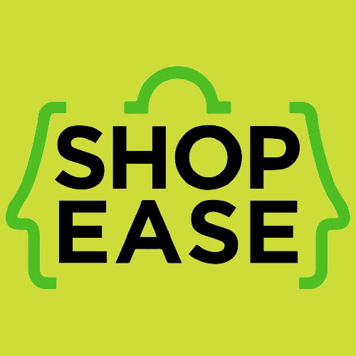

[//]: # (Votes Wakoli - Started on: 4th July, 2023)
# ShopEase Ecommerce Store
**An Ecommerce Store UI Flutter project.** - Still Under Development

## UI Screenshots
**Onboarding Screens** 
<!--  -->
**Sign Up**

**Login**

**Home Screen**

**Details**

**Cart Screen**

**User Profile**

## Getting Started

Loving Flutter?, Here are few resources to get you started if this is your first Flutter project:

- [Lab: Write your first Flutter app](https://docs.flutter.dev/get-started/codelab)
- [Cookbook: Useful Flutter samples](https://docs.flutter.dev/cookbook)

For help getting started with Flutter development, view the
[online documentation](https://docs.flutter.dev/), which offers tutorials,
samples, guidance on mobile development, and a full API reference.
